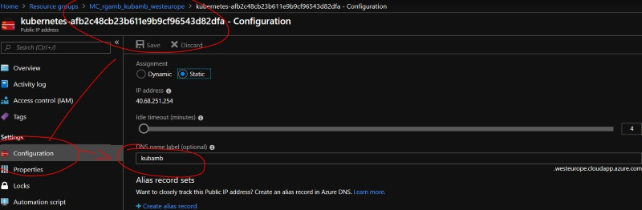
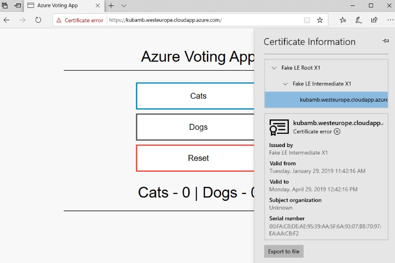

# Installing Let's Encrypt on a AKS cluster with Ambassador

## TL;DR

Installing a certificate in **kubernetes** is pretty straightforward, using tools like [cert-manager](http://cert-manager.readthedocs.io/).  

For [various reasons](https://www.getambassador.io/concepts/developers#ingress-resources) [ambassador](https://www.getambassador.io/) does not use any **ingresses** ressources to expose its routes.  

Unfortunatelly that's what **cert-manager** needs, to be able to create a new route to validate and request a certificate from **Let's Encrypt**.

Through this article, we will see how to workaround this limitation, and how configure our cluster to let **cert-manager** knows how to reach its dynamically created pod.

## Requirements

Assuming you have:
- An **Azure** subscription (yes, that could help ! [Start a free trial here](https://azure.microsoft.com/en-us/free/)).
- An **AKS** cluster ready to install (see below for instructions, if you don't already have an up and running cluster, or the [official documentation](https://docs.microsoft.com/en-us/azure/aks/)).
  - This post it not specific to Azure, it works on GCP / AWS as well (just be sure to be able to create a DNS on you cloud provider)
- The **Helm** CLI installed locally (see below for instruction to install **Tiller** on your cluster).
- The **Kubectl** CLI installed locally.
- An application to test: We will use the [Vote tutorial application](https://docs.microsoft.com/en-us/azure/aks/kubernetes-walkthrough) modified (without **LoadBalancer**).
- Because it's better for security, we will use **RBAC** on all the steps.

### Install an AKS cluster

Feel free to use your own cluster on your own cloud provider !

But if you are using **Azure**, we need to install an **AKS**.  
Here are some commands to install your cluster, if needed:

```cmd
-- Create a new resource group
$ az group create --name rgamb --location westeurope

-- Create a cluster named kubamb with 3 nodes and get the ssh keys locally
$ az aks create -g rgamb --name kubamb --node-count 3 --kubernetes-version 1.11.5 --generate-ssh-keys

-- Get the credentials from kubernetes cluster to be able to use kubectl command line, locally
$ az aks get-credentials -g rgamb -n kubamb

```

Don't forget to install `Kubectl` CLI on your machine, if not already done:
``` cmd
-- Installing kubectl CLI on your machine
$ az aks install-cli
```

### Installing helm

Before going further, you will need to install the **helm** CLI locally.   
More information on the official helm documentation : [Installing helm](https://docs.helm.sh/using_helm/#installing-helm)

Then, because **RBAC** is enabled by default on our **AKS** cluster, we need to role-binding the service account for helm:

See [helm-rbac.yaml](./helm-rbac.yaml) file.

```cmd
$ kubectl apply -f helm-rbac.yaml
```

Then we can install **Tiller** through **Helm** CLI:

```cmd
$ helm init --service-account tiller --upgrade
```

## Installing tutorial application

For our sample, we will use a simple application [vote.yaml](./vote.yaml) (A web application relying on a small redis cache).   
In this demo, the `vote.yaml` application is created without any `LoadBalancer`.
The load balancer will be handled later by **ambassador**.

```cmd
$ kubectl apply -f vote.yaml
```

## Installing ambassador

The main differences between the official ambassador yaml script and the [ambassador-https.yaml](./ambassador-https.yaml) presented here are:

- The ambassador service is itself self annotated to use **TLS**.
- The ambassador service use the **443** port only.
- For demo purpose RBAC stuff allows everything for the ambassador service account.

```yaml
apiVersion: v1
kind: Service
metadata:
  creationTimestamp: null
  labels:
    service: ambassador
  name: ambassador
  annotations:
    getambassador.io/config: |
      ---
      apiVersion: ambassador/v0
      kind: Module
      name: tls
      config:
        server:
          enabled: True
          # redirect_cleartext_from: 80
spec:
  type: LoadBalancer
  externalTrafficPolicy: Local
  ports:
    - name: ambassador-https
      port: 443
      targetPort: https
  selector:
    service: ambassador
```

Once **ambassador** is installed, **ambassador** will check the **secret** to get a token called **ambassador-certs**

Since we did not create the secret so far, we will have to restart the pod, later.  

**So why install **ambassador** now ?** 

Because we need a load balancer and an Azure public IP, that will be provisioned by Azure (just wait a couple of minutes).

``` cmd
$ kubectl get svc
NAME                     TYPE           CLUSTER-IP     EXTERNAL-IP     PORT(S)                      AGE
acme-challenge-service   ClusterIP      10.0.241.86    <none>          80/TCP                       1h
ambassador               LoadBalancer   10.0.56.51     40.68.251.254   443:32693/TCP,80:30218/TCP   1h
ambassador-admin         NodePort       10.0.246.249   <none>          8877:32741/TCP               1h
azure-vote-back          ClusterIP      10.0.193.186   <none>          6379/TCP                     1h
azure-vote-front         ClusterIP      10.0.67.160    <none>          80/TCP                       1h
kubernetes               ClusterIP      10.0.0.1       <none>          443/TCP                      2h
```

> Using `redirect_cleartext_from: 80` will redirect all clear traffic (http) to https.   
> BUT because we don't have yet the SSL installed, the next steps will fail. So just comment it for now, and uncomment once you restart (at the end) the ambassador pod

## DNS

Then create a DNS on the Azure **Ingress Load balancer Publique IP**



In my sample my DNS is `kubamb.westeurope.cloudapp.azure.com`.

## Cert manager

Installing cert manager is quite simple, just run the correct **helm** command:

```cmd
helm install stable/cert-manager --namespace kube-system --set ingressShim.defaultIssuerName=letsencrypt-staging --set ingressShim.defaultIssuerKind=ClusterIssuer
```

### Create certificate & issuer

cert manager will use a **Cluster Issuer** and a **Certificate** resource definition to handle the creation of your certificate.   
See [tls.yaml](tls.yaml) for details

```cmd
kubectl apply -f tls.yaml
```

Interesting points on the **Certificate** part:
- Use the correct dns name `kubamb.westeurope.cloudapp.azure.com`
- Use the name `ambassador-certs` to name the secret (important because ambassador will check this particular name)
- Use the correct namespace, same as **ambassador**.

```yaml
apiVersion: certmanager.k8s.io/v1alpha1
kind: Certificate
metadata:
  name: ambassador-certs
  # cert-manager will put the resulting Secret in the same Kubernetes namespace
  # as the Certificate. Therefore you should put this Certificate in the same namespace as Ambassador.
  namespace: default
spec:
  # naming the secret name certificate ambassador-certs is important because
  # ambassador just look for THIS particular name
  secretName: ambassador-certs
  issuerRef:
    name: letsencrypt-staging
    kind: ClusterIssuer
  dnsNames:
    - kubamb.westeurope.cloudapp.azure.com
  acme:
    config:
      - http01:
          ingressClass: nginx
        domains:
          - kubamb.westeurope.cloudapp.azure.com
```


## Here comes the troubles

**cert-manager** will try to valid the domain using the [http-01 challenge](https://tools.ietf.org/html/draft-ietf-acme-acme-03#section-7.2). But it will fail (yes, absolutely...)

**cert-manager** will need to expose a specific http address (`.well-known/acme-challenge/A_TOKEN`) that will respond with a specific body.  
In our example, something like `http://kubamb.westeurope.cloudapp.azure.com/.well-known/acme-challenge/evaG....t92wr-oA`

To do this required step, to prove to **Let's Encrypt** we are the owner of the DNS, **cert-manager** will dynamically:

- Create a temporary **pod** called `cm-acme-http-solver-xxxx`
- Create a temporary **service** called `cm-acme-http-solver-xxxx`
- Create a temporary **ingress** called `cm-acme-http-ingress-xxxx`

``` cmd
$ kubectl get pod
NAME                                READY     STATUS    RESTARTS   AGE
ambassador-7cd4d5c5f-2h6tq          1/1       Running   0          25m
azure-vote-back-5db676f7d-gjjrb     1/1       Running   0          29m
azure-vote-front-559f8954f4-px2p9   1/1       Running   0          29m
cm-acme-http-solver-hbx5z           1/1       Running   0          1m
```

``` cmd
$ kubectl get svc
NAME                        TYPE           CLUSTER-IP     EXTERNAL-IP     PORT(S)                      AGE
ambassador                  LoadBalancer   10.0.56.51     40.68.251.254   443:32693/TCP,80:30218/TCP   26m
ambassador-admin            NodePort       10.0.246.249   <none>          8877:32741/TCP               26m
azure-vote-back             ClusterIP      10.0.193.186   <none>          6379/TCP                     30m
azure-vote-front            ClusterIP      10.0.67.160    <none>          80/TCP                       30m
cm-acme-http-solver-ls6s2   NodePort       10.0.40.188    <none>          8089:30217/TCP               1m
kubernetes                  ClusterIP      10.0.0.1       <none>          443/TCP                      59m
```

**Because we don't have any ingress controller, `cert-manager` won't be able to expose its pod !**

That's why we have such logs on the `cert-manager` pod:

```cmd
Preparing certificate default/ambassador-certs with issuer
Calling GetOrder
Calling GetAuthorization
Calling HTTP01ChallengeResponse
Cleaning up old/expired challenges for Certificate default/ambassador-certs
Calling GetChallenge
wrong status code '404'
Looking up Ingresses for selector certmanager.k8s.io/acme-http-domain=161156668,certmanager.k8s.io/acme-http-token=1100680922
Error preparing issuer for certificate default/ambassador-certs: http-01 self check failed for domain "kubamb.westeurope.cloudapp.azure.com"
```

Notice the **selector** used to get the correct pod , we will need them later.
``` yaml
certmanager.k8s.io/acme-http-domain: "161156668"
certmanager.k8s.io/acme-http-token: "1100680922"
```

### Creating a service that will redirect to the correct pod

The idea here is to create a service [challenge-service.yaml](./challenge-service.yaml) in a *ambassador way* to handle correctly the route to `.well-known/acme-challenge/A_TOKEN` to the correct **cert-manager** dynamic pod.

``` yaml
---
apiVersion: v1
kind: Service
metadata:
  name: acme-challenge-service
  annotations:
    getambassador.io/config: |
      ---
      apiVersion: ambassador/v0
      kind:  Mapping
      name:  acme-challenge-mapping
      # known based uri to reach for HTTP-01 validation challenge
      prefix: /.well-known/acme-challenge
      # Because ambassador will by default rewrite url with service name, just configure to not rewrite anything
      rewrite: ""
      # TODO : Service name should point on this service who will use selector to reach the pod
      # like service: acme-challenge-service
      # Here we forward to another service
      service: acme-challenge-service 
spec:
  ports:
  - port: 80
    targetPort: 8089
  selector:
    # How to recognize the 
    # See https://github.com/datawire/ambassador/issues/780 
    certmanager.k8s.io/acme-http-domain: "161156668"
    certmanager.k8s.io/acme-http-token: "1100680922"    
    
```
Once this new service is deployed, no need to launch again **cert-manager**, just wait a couple of minutes and trace the logs :

``` cmd
Calling GetOrder
Calling GetAuthorization
Calling HTTP01ChallengeResponse
Cleaning up old/expired challenges for Certificate default/ambassador-certs
Calling GetChallenge
Accepting challenge for domain "kubamb.westeurope.cloudapp.azure.com"
Calling AcceptChallenge
Waiting for authorization for domain "kubamb.westeurope.cloudapp.azure.com"
Calling WaitAuthorization
Successfully authorized domain "kubamb.westeurope.cloudapp.azure.com"
Cleaning up challenge for domain "kubamb.westeurope.cloudapp.azure.com" as part of Certificate default/ambassador-certs
```

Once done, you should have a new cert created with the correct name in the kubernetes secrets:

``` cmd
$ kubectl get secret
NAME                     TYPE                                  DATA      AGE
ambassador-certs         kubernetes.io/tls                     2         1h
ambassador-token-846d5   kubernetes.io/service-account-token   3         2h
default-token-4l772      kubernetes.io/service-account-token   3         2h
```

> Once the certificate is created, **cert-manager** will delete all the temp stuff he created (service, pod, ingress)

## Restart ambassador

Since ambassador will only handle the **TLS** certificate when it starts, you will have to restart it (juste delete the pod)

Now you're application should works on **https** (with a temp Let's Encrypt certificate):

